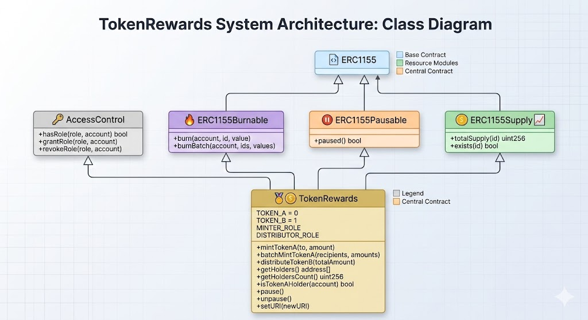
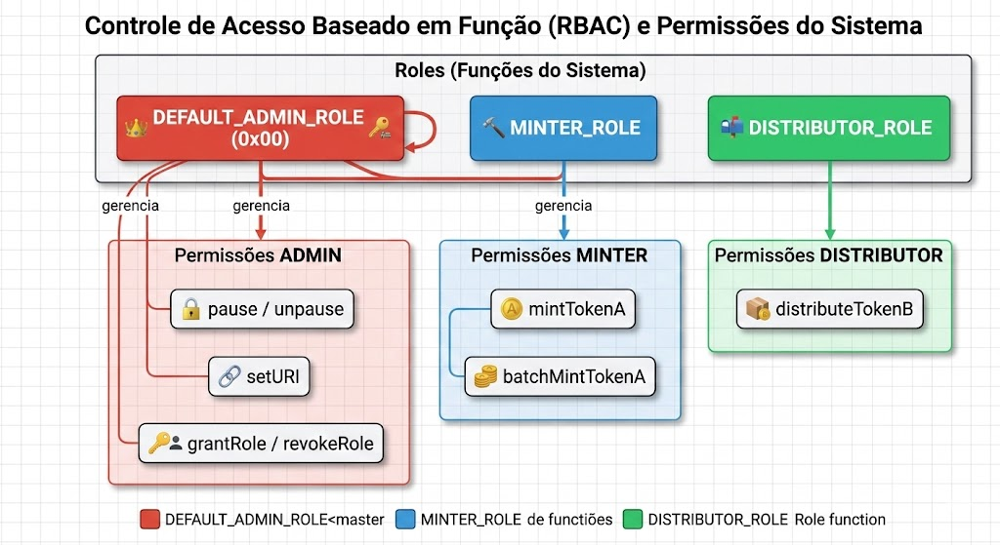
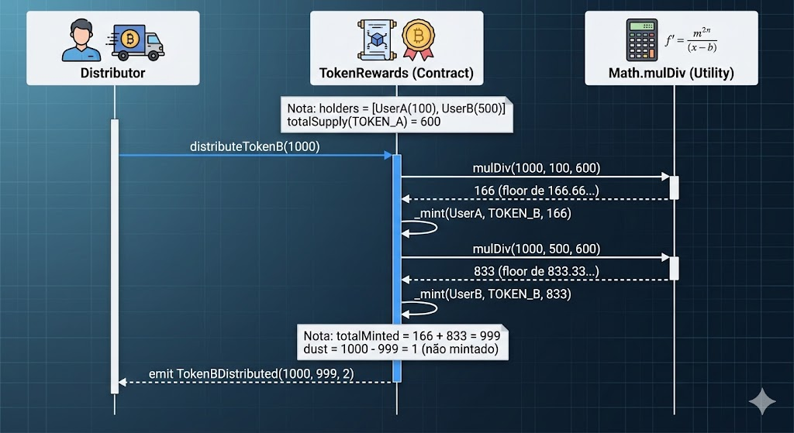
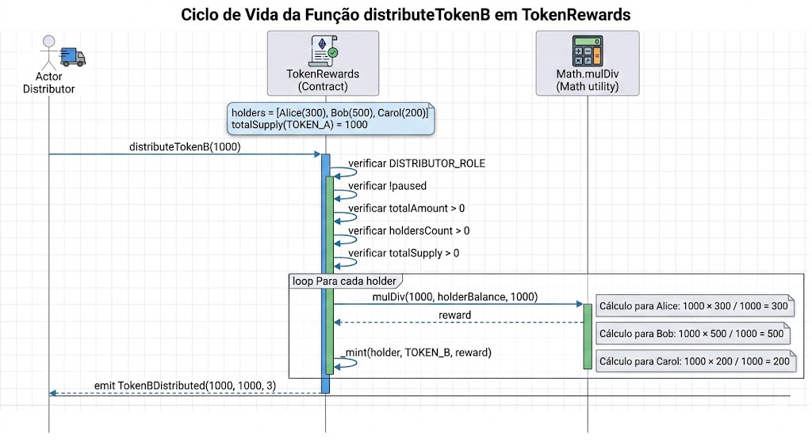

# TokenRewards

Smart contract ERC-1155 com dois tipos de token: **Token A** (membership) e **Token B** (recompensa proporcional). O distribuidor aciona a mintagem do Token B diretamente para todos os holders de Token A em uma unica transacao, proporcional ao saldo de cada holder.

Construido com [Foundry](https://book.getfoundry.sh/) e [OpenZeppelin Contracts v5](https://docs.openzeppelin.com/contracts/5.x/).

## Sumario

- [Arquitetura](#arquitetura)
- [Controle de Acesso](#controle-de-acesso)
- [Fluxo de Distribuicao](#fluxo-de-distribuicao)
- [Ciclo de Vida](#ciclo-de-vida)
- [Estrutura do Projeto](#estrutura-do-projeto)
- [Primeiros Passos](#primeiros-passos)
- [Comandos](#comandos)
- [Deploy](#deploy)
- [Testes](#testes)
- [Seguranca](#seguranca)
- [Licenca](#licenca)

## Arquitetura

O contrato herda de quatro modulos do OpenZeppelin para compor suas funcionalidades:



| Modulo | Finalidade |
|--------|------------|
| **ERC1155Burnable** | Permite holders queimarem seus proprios tokens |
| **ERC1155Pausable** | Admin pode pausar todas as transferencias, mints e burns |
| **ERC1155Supply** | Rastreamento on-chain de `totalSupply()` por token ID |
| **AccessControl** | Sistema de permissoes baseado em roles com tres papeis |

### Token IDs

| Token | ID | Finalidade |
|-------|----|------------|
| **Token A** | `0` | Token de membership — determina a parcela de recompensa |
| **Token B** | `1` | Token de recompensa — distribuido proporcionalmente aos holders de Token A |

Ambos os tokens sao baseados em inteiros (ERC-1155 nao possui decimals). `100` tokens = `100` unidades.

## Controle de Acesso

Tres roles governam todas as operacoes privilegiadas:



| Role | Hash | Permissoes |
|------|------|------------|
| `DEFAULT_ADMIN_ROLE` | `0x00...00` | `grantRole`, `revokeRole`, `pause`, `unpause`, `setURI` |
| `MINTER_ROLE` | `keccak256("MINTER_ROLE")` | `mintTokenA`, `batchMintTokenA` |
| `DISTRIBUTOR_ROLE` | `keccak256("DISTRIBUTOR_ROLE")` | `distributeTokenB` |

No deploy, o endereco `admin` recebe as tres roles. O `DEFAULT_ADMIN_ROLE` e o role admin de todas as roles (pode conceder/revogar qualquer role).

## Fluxo de Distribuicao

O mecanismo central: Token B e distribuido proporcionalmente aos saldos de Token A no momento da transacao.



### Formula

```
recompensa(holder) = floor(totalAmount x saldoDoHolder / totalSupply(TOKEN_A))
```

Utiliza `Math.mulDiv` (OpenZeppelin) para evitar overflow intermediario.

### Exemplo

| Holder | Saldo Token A | Participacao | Token B Recebido |
|--------|---------------|--------------|-----------------|
| Alice | 300 | 30% | 300 |
| Bob | 500 | 50% | 500 |
| Carol | 200 | 20% | 200 |
| **Total** | **1000** | **100%** | **1000** |

### Dust (Resto)

Quando a divisao nao e exata, o Solidity arredonda para baixo (`floor`). O restante nao mintado (dust) e no maximo `holdersCount - 1` unidades e simplesmente nao e mintado. O evento `TokenBDistributed(totalAmount, totalMinted, holdersCount)` reporta o valor real distribuido.

**Exemplo com dust:** distribuindo `1000` entre holders com `600` de supply total de Token A:
```
UserA (100):  floor(1000 x 100 / 600) = 166
UserB (500):  floor(1000 x 500 / 600) = 833
Total mintado: 999 (dust = 1)
```

## Ciclo de Vida



1. **Deploy** — contrato e criado com o endereco `admin` e a `uri` de metadados
2. **Configurar Roles** — admin opcionalmente concede `MINTER_ROLE` e `DISTRIBUTOR_ROLE` para outras contas
3. **Mintar Token A** — minter distribui tokens de membership para os usuarios
4. **Distribuir Token B** — distribuidor aciona a distribuicao proporcional de recompensas (repetivel)
5. **Burn / Transfer** — holders podem queimar ou transferir seus tokens a qualquer momento

O admin pode chamar `pause()` a qualquer momento, bloqueando todos os mints, transferencias, burns e distribuicoes. `setURI()` funciona mesmo com o contrato pausado.

## Estrutura do Projeto

```
token-rewards/
├── src/
│   └── TokenRewards.sol           # Contrato principal
├── script/
│   └── TokenRewards.s.sol         # Script de deploy (Foundry)
├── test/
│   ├── Base.t.sol                 # Setup compartilhado dos testes
│   ├── Constructor.t.sol          # Testes do constructor e roles (26 testes)
│   ├── MintTokenA.t.sol           # Testes de mint individual (15 testes)
│   ├── BatchMintTokenA.t.sol      # Testes de mint em batch (13 testes)
│   ├── DistributeTokenB.t.sol     # Testes de distribuicao (15 testes)
│   ├── Transfer.t.sol             # Testes de transferencia (13 testes)
│   ├── Burn.t.sol                 # Testes de burn (12 testes)
│   ├── Pause.t.sol                # Testes de pause (17 testes)
│   ├── echidna/
│   │   ├── TokenRewardsEchidna.sol  # Invariantes de fuzzing
│   │   └── echidna.yaml             # Configuracao do Echidna
│   └── halmos/
│       └── TokenRewards.halmos.t.sol  # Verificacao formal
├── security/
│   ├── slither-report.md           # Relatorio Slither (analise estatica)
│   ├── slither-report.json         # Saida JSON do Slither
│   ├── echidna-report.txt          # Relatorio Echidna (fuzzing)
│   ├── echidna-report.json         # Saida JSON do Echidna
│   ├── echidna-coverage.html       # Cobertura visual do Echidna
│   └── halmos-report.md            # Relatorio Halmos (verificacao formal)
├── docs/
│   ├── Architecture.png
│   ├── AccessControl.png
│   ├── Distribute.png
│   ├── LifeCycle.png
│   └── diagrams.md               # Fonte Mermaid dos diagramas
├── Makefile                       # Comandos de build, teste e deploy
├── foundry.toml                   # Config do Foundry (Solc 0.8.24, EVM Cancun)
└── .env.example                   # Template de variaveis de ambiente
```

## Primeiros Passos

### Pre-requisitos

- [Foundry](https://book.getfoundry.sh/getting-started/installation)
- [Slither](https://github.com/crytic/slither) (opcional, para analise estatica)
- [Echidna](https://github.com/crytic/echidna) (opcional, para fuzzing)
- [Halmos](https://github.com/a16z/halmos) (opcional, para verificacao formal)

### Instalacao

```bash
git clone <repo-url>
cd token-rewards
make install
```

### Configuracao do Ambiente

```bash
cp .env.example .env
# Edite o .env com seus valores
```

| Variavel | Descricao |
|----------|-----------|
| `RPC_URL` | Endpoint RPC da rede alvo |
| `PRIVATE_KEY` | Chave privada do deployer (sem prefixo 0x) |
| `ADMIN_ADDRESS` | Endereco que recebe todas as roles no deploy |
| `TOKEN_URI` | URI base para metadados ERC-1155 |
| `ETHERSCAN_API_KEY` | API key do block explorer para verificacao |

## Comandos

Todos os comandos estao disponiveis via `make`:

### Build

```bash
make build         # Compila os contratos
make clean         # Remove artefatos de build
make sizes         # Mostra o tamanho dos contratos
```

### Testes

```bash
make test          # Roda todos os testes (111 testes)
make test-v        # Testes com output verboso (stack traces)
make test-gas      # Testes com relatorio de gas
make coverage      # Relatorio de cobertura
```

### Seguranca

```bash
make slither       # Analise estatica (Slither)
make echidna       # Fuzzing (Echidna)
make halmos        # Verificacao formal (Halmos)
make security      # Roda as tres ferramentas em sequencia
```

### Formatacao

```bash
make fmt           # Formata o codigo
make fmt-check     # Verifica formatacao (CI)
```

### Utilitarios

```bash
make snapshot      # Gas snapshot
make all           # clean + build + test + fmt-check
```

## Deploy

### Local (Anvil)

```bash
# Terminal 1: inicia o no local
make anvil

# Terminal 2: deploy com conta padrao do Anvil
make deploy-local
```

### Testnet / Mainnet

Configure o `.env` primeiro, depois:

```bash
make deploy-dry       # Simula (nenhuma transacao enviada)
make deploy           # Deploy na rede configurada
make deploy-verify    # Deploy + verificacao no block explorer
```

O script de deploy le `ADMIN_ADDRESS` e `TOKEN_URI` do ambiente e faz o deploy do contrato com o admin recebendo `DEFAULT_ADMIN_ROLE`, `MINTER_ROLE` e `DISTRIBUTOR_ROLE`.

## Testes

### Testes Unitarios (111 testes)

| Suite | Testes | Cobertura |
|-------|--------|-----------|
| Constructor | 26 | Roles, interfaces, token IDs, URI, setURI |
| MintTokenA | 15 | Mint individual, controle de acesso, tracking de holders |
| BatchMintTokenA | 13 | Mint em batch, validacao de arrays, deduplicacao |
| DistributeTokenB | 15 | Distribuicao proporcional, dust, eventos |
| Transfer | 13 | Transferencia, add/remove de holders, aprovacoes |
| Burn | 12 | Burn, burnBatch, remocao de holders, aprovacoes |
| Pause | 17 | Pause/unpause de todas as operacoes |

### Convencao de Nomes dos Testes

Os testes seguem o padrao:
- `test_Should_<comportamento esperado>` — caminho feliz
- `test_RevertWhen_<condicao>` — reverts esperados

## Seguranca

O contrato foi validado com tres ferramentas complementares de seguranca. Os relatorios completos estao em `security/`.

```bash
make slither       # Analise estatica
make echidna       # Fuzzing
make halmos        # Verificacao formal
make security      # Roda as tres em sequencia
```

---

### Analise Estatica — Slither v0.11.5

| Severidade | Quantidade |
|------------|------------|
| High | 0 |
| Medium | 0 |
| Low | 0 |
| Informational | 6 (mesmo detector) |

**Resultado: PASS** — nenhum finding de severidade media ou superior.

**Finding informacional:** `costly-loop` (6 instancias) — Slither detectou que `_removeHolder()` realiza operacoes de storage dentro de loops em `batchMintTokenA` e `distributeTokenB`.

**Classificacao: Falso positivo** — seguro por design:
- Em `batchMintTokenA`, o `_removeHolder` nunca executa porque mint **aumenta** saldo e o guard `from != address(0)` impede a remocao durante mints
- Em `distributeTokenB`, o loop minta **Token B** (id=1) e `_removeHolder` so e acionado para `TOKEN_A` (id=0), entao a branch nunca e alcancada
- Mesmo no pior caso teorico, `_removeHolder` e O(1) por chamada (swap-and-pop)

---

### Fuzzing — Echidna v2.3.1

**Configuracao:** 50.000 transacoes | sequencias de 100 txs | 3 atores (Alice, Bob, Carol)

**Resultado: 7/7 propriedades PASSING**

| Propriedade | Status |
|-------------|--------|
| `echidna_holdersCount_matches_actual` — holdersCount == contagem real de holders | PASS |
| `echidna_isHolder_consistent_with_balance` — isHolder sse balance > 0 | PASS |
| `echidna_totalSupplyA_equals_sum_of_balances` — supply A == soma dos saldos | PASS |
| `echidna_totalSupplyB_equals_sum_of_balances` — supply B == soma dos saldos | PASS |
| `echidna_holders_array_length_matches_count` — getHolders().length == getHoldersCount() | PASS |
| `echidna_zero_balance_not_holder` — saldo zero nao e marcado como holder | PASS |
| `echidna_holdersCount_bounded` — holdersCount nunca excede o maximo esperado | PASS |

**Cobertura:** 78/78 linhas (100%) | 50.249 chamadas totais | 14.624 instrucoes unicas

**Acoes fuzzadas:** mint, batchMint, distributeTokenB, burn, burnBatch, safeTransferFrom, pause, unpause e views.

Arquitetura com proxy — cada ator e um contrato `ActorProxy` que pode burn/transfer seus proprios tokens, resolvendo as verificacoes de `msg.sender` do ERC1155.

---

### Verificacao Formal — Halmos v0.3.3

**Resultado: 12/12 verificacoes simbolicas PASSING**

#### Mint (3 checks)

| Check | Paths | Tempo | Resultado |
|-------|-------|-------|-----------|
| `check_mintTokenA_increases_balance` | 2 | 0.07s | PASS |
| `check_mintTokenA_increases_totalSupply` | 2 | 0.07s | PASS |
| `check_mintTokenA_adds_holder` | 2 | 0.07s | PASS |

Para **qualquer** `to` valido e `amount > 0`, balance e totalSupply aumentam exatamente `amount`, e `isTokenAHolder(to)` se torna true.

#### Transfer (2 checks)

| Check | Paths | Tempo | Resultado |
|-------|-------|-------|-----------|
| `check_transfer_conserves_supply` | 5 | 0.54s | PASS |
| `check_transfer_updates_balances` | 5 | 0.61s | PASS |

Para **qualquer** transferencia valida, totalSupply e invariante. Remetente perde exatamente `amount`, destinatario ganha exatamente `amount`.

#### Burn (3 checks)

| Check | Paths | Tempo | Resultado |
|-------|-------|-------|-----------|
| `check_burn_decreases_balance` | 3 | 0.39s | PASS |
| `check_burn_decreases_totalSupply` | 3 | 0.41s | PASS |
| `check_burn_removes_holder_when_zero` | 2 | 0.12s | PASS |

Para **qualquer** burn valido, balance e totalSupply diminuem exatamente `amount`. Quando balance chega a 0, holder e removido do tracking.

#### Distribuicao (2 checks)

| Check | Paths | Tempo | Resultado |
|-------|-------|-------|-----------|
| `check_distribute_does_not_revert_for_valid_inputs` | 7 | 0.41s | PASS |
| `check_distribute_no_mint_when_zero_balance` | 7 | 0.45s | PASS |

Para **qualquer** distribuicao valida, a funcao nao reverte, supply de Token A permanece inalterado e holders continuam rastreados.

> **Nota:** A conservacao aritmetica do `mulDiv` (`sum(rewards) <= totalAmount`) nao e verificavel simbolicamente devido a aritmetica nao-linear de 512 bits. Esta propriedade e coberta pelo fuzzing do Echidna (50K+ transacoes, 100% de cobertura).

#### Controle de Acesso (2 checks)

| Check | Paths | Tempo | Resultado |
|-------|-------|-------|-----------|
| `check_only_minter_can_mint` | 2 | 0.03s | PASS |
| `check_only_admin_can_pause` | 1 | 0.01s | PASS |

Para **qualquer** caller sem a role necessaria, `mintTokenA` e `pause` revertem.

---

### Complementaridade das Ferramentas

| Propriedade | Slither | Echidna | Halmos |
|-------------|---------|---------|--------|
| Padroes de vulnerabilidade (reentrancy, etc.) | Verificado | — | — |
| Aritmetica de balance (mint/burn/transfer) | — | Fuzzado (50K+ txs) | Provado para TODAS as entradas |
| Conservacao de supply | — | Fuzzado (50K+ txs) | Provado para TODAS as entradas |
| Tracking de holders (add/remove) | — | Fuzzado (50K+ txs) | Provado para TODAS as entradas |
| Conservacao da distribuicao (sum <= total) | — | Verificado (50K+ txs) | Timeout (mulDiv 512-bit) |
| Controle de acesso por roles | — | Fuzzado (50K+ txs) | Provado para TODOS os callers |

### Consideracoes de Seguranca

- **AccessControl** — roles separadas previnem escalacao de privilegios
- **Math.mulDiv** — aritmetica segura evita overflow no calculo de distribuicao
- **Tracking on-chain de holders** — padrao swap-and-pop para add/remove em O(1)
- **Pausable** — circuit breaker de emergencia para todas as operacoes que alteram estado
- **Sem chamadas externas** — distribuicao e push-based (sem risco de callback)

## Licenca

MIT
