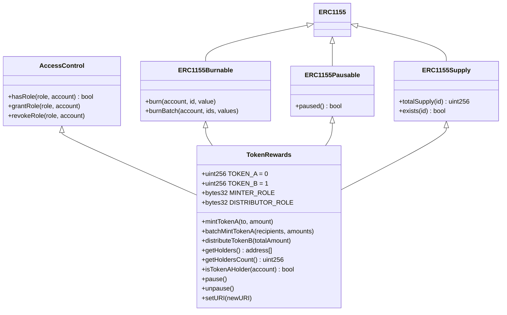
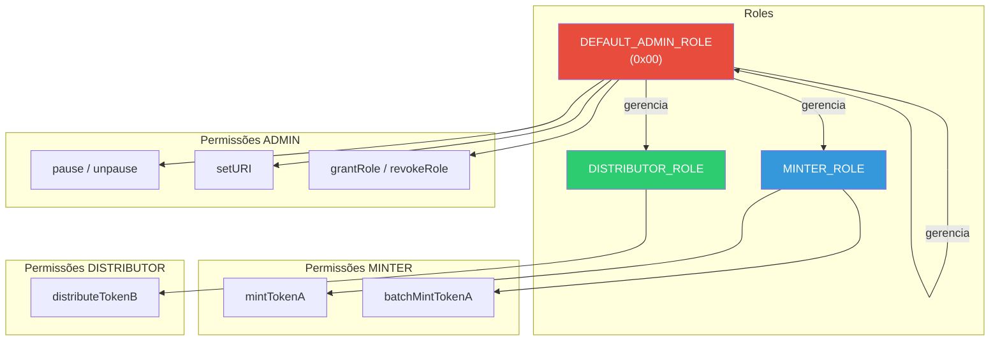
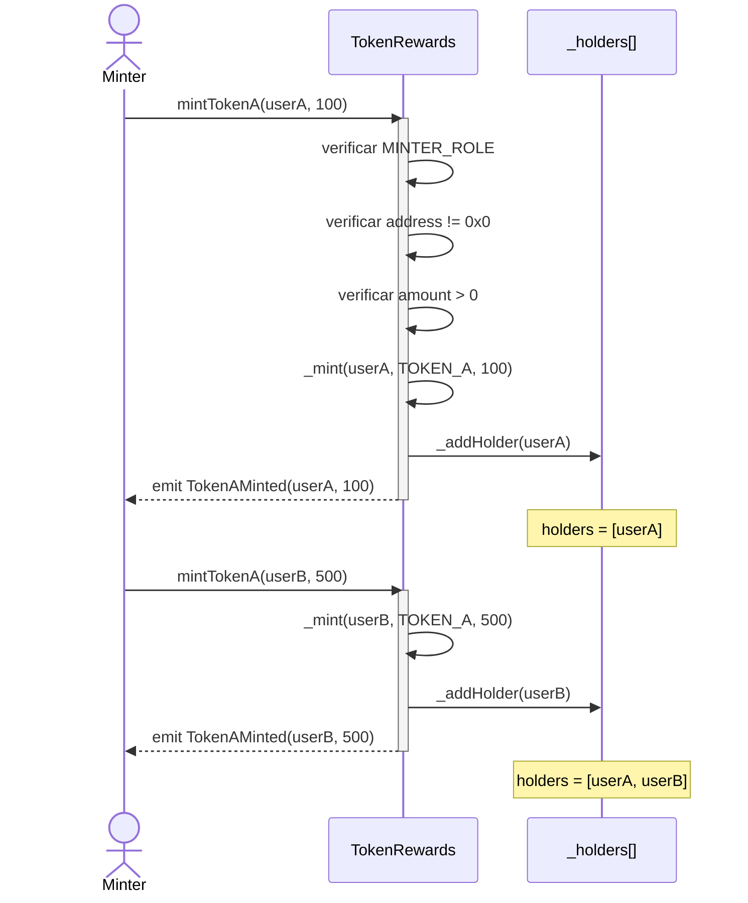
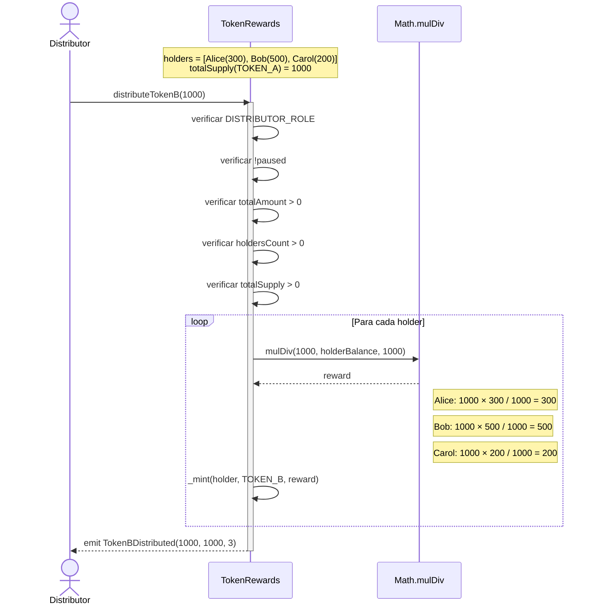
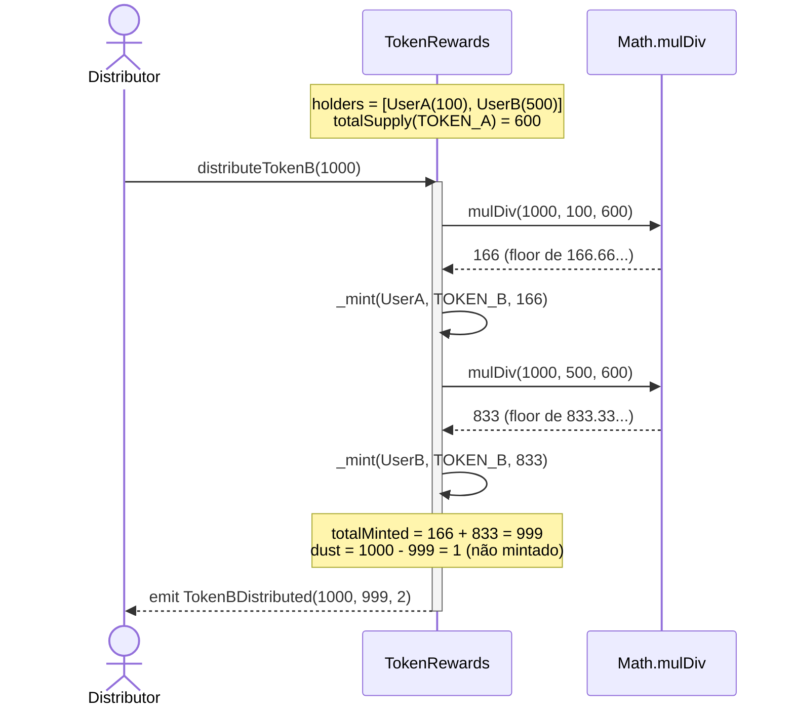
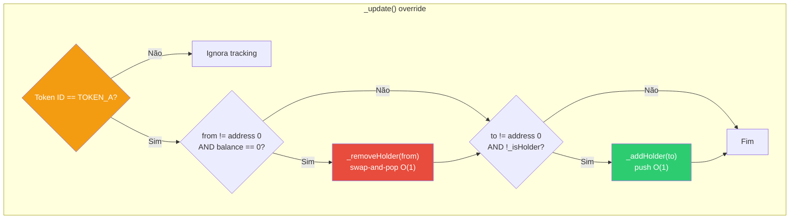
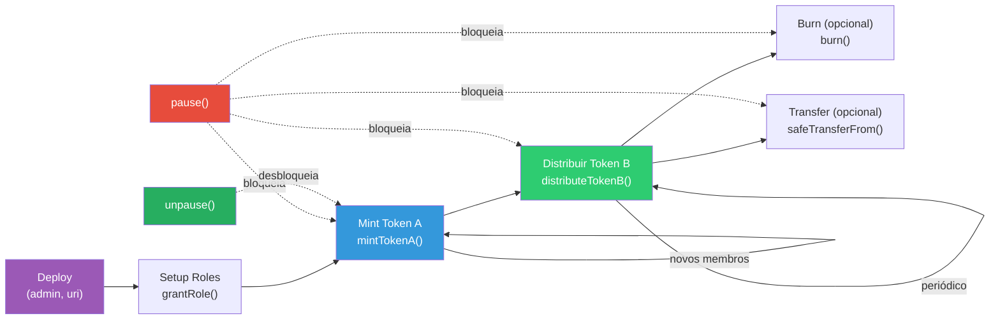
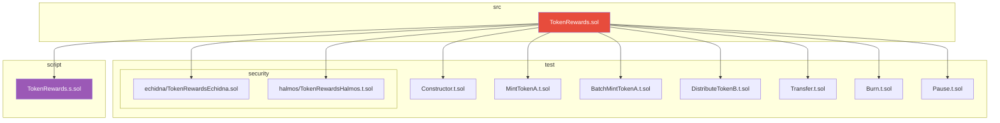

# TokenRewards — Diagramas

## 1. Arquitetura do Contrato (Herança)

## 2. Sistema de Roles (Access Control)

## 3. Fluxo de Mint Token A

## 4. Fluxo de Distribuição Token B (Reward)

## 5. Fluxo de Distribuição com Dust

## 6. Tracking de Holders (Add / Remove)

## 7. Ciclo de Vida Completo

## 8. Estrutura do Projeto

